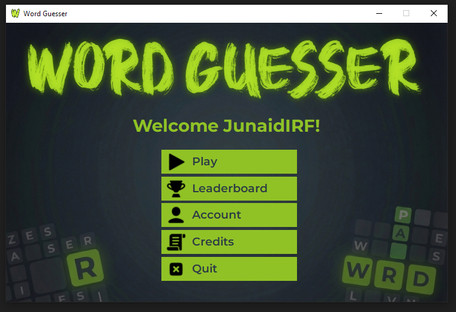
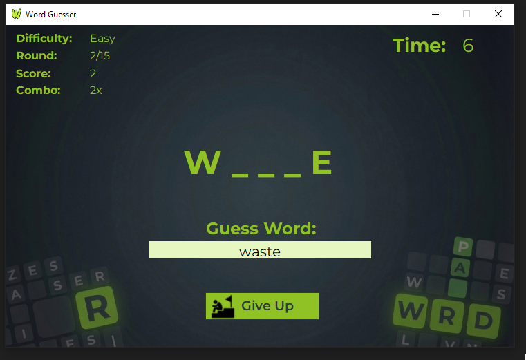

  

<h1 align="center">Word Guesser</h1>

  <b>A pattern-based word puzzle game built with C++ and Windows Forms</b> 
  University First Semester Project

  
  
  

---

  
  

Guess any valid dictionary word that matches the pattern — given a starting letter, ending letter, and word length (e.g., `S _ _ _ E` → "SMILE", "SLOPE", etc.).

## ✨ Features

- 🎮 **Multiple Difficulty Levels** — Easy, Medium, and Hard
- ⏱️ **Challenge Modes** — Speedrun, Comeback, Perfectionist, Clutch Master
- 👤 **User Accounts** — Registration, login, and profile pictures
- 🏆 **Leaderboard** — Global ranking with Gold/Silver/Bronze highlights
- 🎖️ **Milestones** — Achievement badges at score thresholds
- 🔊 **Audio Feedback** — Hover and click sounds

## 🚀 Getting Started

### Installation

1. Download and install [**Visual C++ Redistributable**](https://aka.ms/vs/17/release/vc_redist.x64.exe) (if not already installed)
2. Download the latest release from [**Releases**](https://github.com/JunaidIRF/WordGuesser/releases/latest)
3. Extract the zip file
4. Run `fonts\install.bat` to install required fonts
5. Launch `WordGuesser.exe`

### How to Play

1. Register or login to your account
2. Select a difficulty level
3. Type any valid word matching the displayed pattern
4. Submit before the timer runs out!

## 📊 Scoring

| Difficulty | Correct | Wrong | Time |
|:----------:|:-------:|:-----:|:----:|
| Easy       | +2      | -1    | 15s  |
| Medium     | +3      | -2    | 30s  |
| Hard       | +5      | -1    | 45s  |

> **Note:** Speedrun mode reduces time limits — Easy: 7s, Medium: 15s, Hard: 25s

## 🎯 Challenge Modes

| Mode | Description | Bonus |
|------|-------------|:-----:|
| Speedrun | Reduced time limits | +10 |
| Comeback | Must lose first 3 rounds | +20 |
| Perfectionist | Zero mistakes allowed | +25 |
| Clutch Master | Submit at exactly 1 second | +10 |

## 📋 Requirements

- Windows OS (64-bit)
- [.NET Framework 4.7.2](https://dotnet.microsoft.com/en-us/download/dotnet-framework/thank-you/net472-web-installer) (pre-installed on Windows 10 build 1803+)
- [Visual C++ Redistributable 2015-2022](https://aka.ms/vs/17/release/vc_redist.x64.exe)

## 📝 License

This project is for educational purposes.
